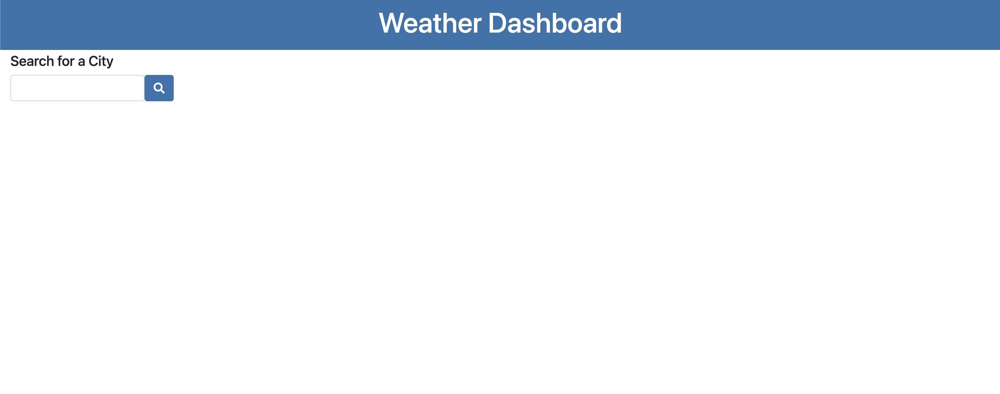
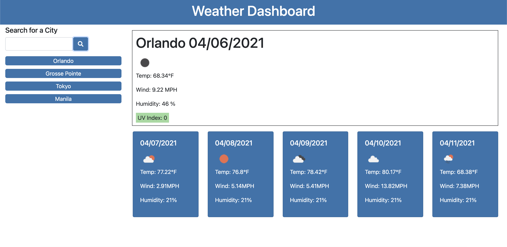
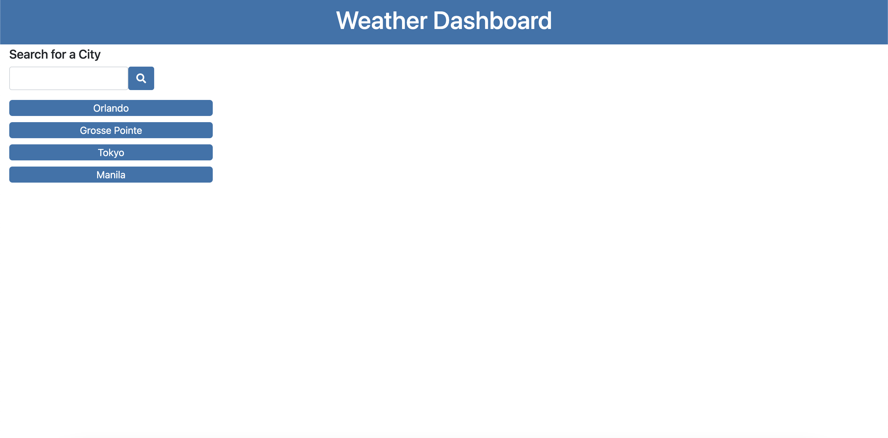

# weather_dashboard

Use this application to search for the weather in your favorite locations!

Enter the city in the search bar on the left, and press the search button.  The forecast for today will show up to the right, with the forecast for the next five days below it.

A button for the city you searched will automatically be created below the search bar.  When you leave the page and come back, localStorage will automatically remember the cities you searched, and display those buttons on the page.

